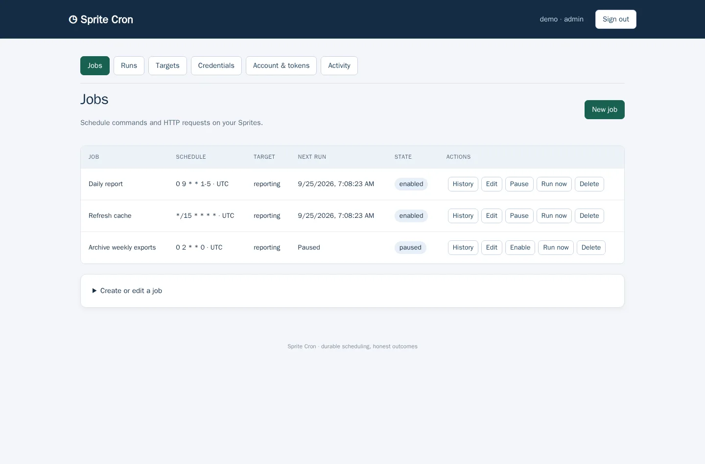
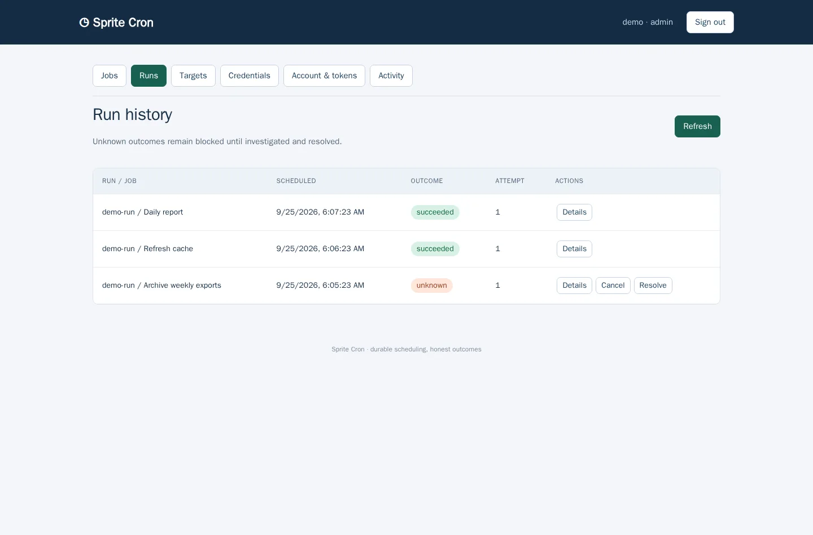

# Sprite Cron

**Your Sprites. On schedule.**

Run commands, shell scripts, and HTTP jobs on [Sprites](https://sprites.dev)—on a cron schedule or whenever you need them. Sprite Cron gives your team one place to schedule recurring work, see what ran, and investigate what happened.

Use it for daily reports, cache refreshes, scheduled exports, maintenance scripts, and the background work that keeps your projects moving. Manage everything in the browser or automate it through the REST API.

**[Get started on Fly.io →](https://sprite-cron.fly.dev/docs/install/)** · [Take a tour](https://sprite-cron.fly.dev/docs/browser/) · [Documentation](https://sprite-cron.fly.dev/docs/)

[](https://sprite-cron.fly.dev/docs/browser/)

*Set schedules, pause jobs, and run them on demand. Screenshots show demo data.*

## Three ways to get work done

| Job type | What it does |
| --- | --- |
| **Exec** | Run an executable with an explicit argument array, working directory, and environment. |
| **Shell** | Run scripts with login profiles, variable expansion, redirects, and pipelines. Bash by default; `/bin/sh` is also supported. |
| **HTTP** | Call an endpoint on a Sprite with a method, path, headers, and body. |

The scheduler runs on Fly.io; your jobs run on your Sprites. [Explore job types and examples →](https://sprite-cron.fly.dev/docs/jobs/)

## A small service with the essentials built in

- **Schedules that fit your work.** Familiar cron expressions, time zones, a next-run preview, and manual triggers.
- **One view of your runs.** Durable history, captured output, exit statuses, and attempt details.
- **Control over repetition.** Overlap prevention, missed-schedule policies, deadlines, cancellation, and retries for jobs you declare safe to repeat.
- **Automation from the start.** Provision credentials and targets, create jobs, and inspect runs through a scoped REST API.
- **Accounts you manage yourself.** Local users, team roles, service accounts, and revocable API tokens. No external identity provider required.
- **Straightforward hosting.** One Go executable with an embedded UI, SQLite, and encrypted credential storage. One always-on Fly Machine and one volume; no Redis or hosted database to provision.

## Know what happened

See successful, failed, and uncertain outcomes in the same history. Open a run to inspect its output and attempts, cancel remote work, or investigate an unknown result before deciding what to do next.

[](https://sprite-cron.fly.dev/docs/runs/)

[Understand run outcomes and recovery →](https://sprite-cron.fly.dev/docs/runs/)

## Start with the guides

**[Install on Fly.io](https://sprite-cron.fly.dev/docs/install/)** walks through deployment, key generation, and your first administrator account. Builds happen remotely—you don't need Go, Docker, or Python installed on your computer for the Fly installation.

Then [connect a Sprite](https://sprite-cron.fly.dev/docs/targets/), [create a job](https://sprite-cron.fly.dev/docs/jobs/), and run it once before enabling its schedule.

| Looking for… | Read this |
| --- | --- |
| A walkthrough of the interface | [Browser tour](https://sprite-cron.fly.dev/docs/browser/) |
| Sprite credentials and application headers | [Targets and credentials](https://sprite-cron.fly.dev/docs/targets/) |
| Commands, scripts, and HTTP requests | [Creating jobs](https://sprite-cron.fly.dev/docs/jobs/) |
| Time zones, overlap, missed runs, and retries | [Scheduling behavior](https://sprite-cron.fly.dev/docs/scheduling/) |
| API authentication and automation | [REST API reference](https://sprite-cron.fly.dev/docs/api/) |
| Users, roles, tokens, and encryption | [Security and access](https://sprite-cron.fly.dev/docs/security/) |
| Backups, restore, upgrades, and key rotation | [Operations guide](https://sprite-cron.fly.dev/docs/operations/) |
| Environment variables and limits | [Configuration](https://sprite-cron.fly.dev/docs/configuration/) |

Sprite Cron is designed for a trusted team using a single scheduler. The [scheduling](https://sprite-cron.fly.dev/docs/scheduling/) and [run lifecycle](https://sprite-cron.fly.dev/docs/runs/) guides explain its execution guarantees and recovery behavior.

## Work on Sprite Cron

For local setup, prerequisites, and the development workflow, see [Local development](https://sprite-cron.fly.dev/docs/development/).

```sh
make build   # Build bin/sprite-cron
make check   # Check formatting, run go vet and race-enabled tests
```
