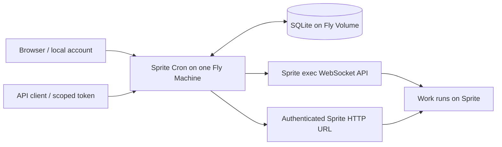

# Sprite Cron

Sprite Cron schedules work on [Sprites](https://sprites.dev). Run commands through the Sprite exec API or invoke an HTTP endpoint served by a Sprite, on a cron schedule or on demand. A small Go service keeps the schedule, execution history, and credentials in SQLite; the actual job runs on the Sprite.

It exists to give persistent, centrally managed schedules to workloads on Sprites without installing a separate scheduler in every Sprite. You can manage jobs in a browser or through a scoped HTTP API. Authentication is local: accounts are created from a shell, passwords are verified by the service, and API tokens are issued and revoked locally. There is no OIDC, email, external identity provider, Redis, or hosted database dependency.

**Deployment model:** one continuously running Fly Machine and one attached Fly Volume. This is an initial implementation for a trusted team, with explicit handling of uncertain remote execution. It does not guarantee exactly-once side effects or provide high availability.

## Contents

- [Features](#features)
- [How it works](#how-it-works)
- [Run locally](#run-locally)
- [Deploy on Fly.io](#deploy-on-flyio)
- [Connect a Sprite](#connect-a-sprite)
- [Create jobs through the API](#create-jobs-through-the-api)
- [Scheduling and execution guarantees](#scheduling-and-execution-guarantees)
- [Accounts, tokens, and secrets](#accounts-tokens-and-secrets)
- [Configuration](#configuration)
- [Operations and recovery](#operations-and-recovery)
- [Development and validation](#development-and-validation)

## Features

- Five-field cron expressions with an IANA time zone per job and a next-run preview.
- Exec jobs with an argument vector, working directory, environment additions, stdout/stderr capture, and an exit status.
- Shell jobs with login profiles, command substitution, redirects, and pipelines; Bash by default, with `/bin/sh` selectable.
- HTTP jobs with a method, relative path, headers, body, status policy, and response capture.
- Browser management of jobs, targets, encrypted credentials, run history, and personal API tokens.
- Local administrator, operator, and reader accounts; non-interactive service accounts.
- API tokens with explicit scopes, target restrictions, expiry, and immediate revocation.
- Durable run records, immutable job/target snapshots, manual-trigger deduplication, overlap prevention, and optional safe retries.
- Per-attempt deadlines, remote exec termination, bounded output, recovery after restart, and visible `unknown` outcomes when completion cannot be established.
- Audit events, readiness checks, online SQLite backups, offline restore, and encryption-key rotation.
- A single executable with embedded browser assets and time-zone data; no JavaScript build step.

## How it works



The scheduler checks for due work every second. Creating a scheduled run and advancing the job's schedule cursor happen in one database transaction. A unique occurrence key prevents the same job revision and scheduled timestamp from being materialized twice. Workers claim durable runs before contacting Sprites. Concurrency defaults to ten attempts globally and two per target.

Each run keeps the job configuration and target identity from dispatch planning. Editing a job cannot change an existing run's command. Credential **references** are snapshotted; the current encrypted value is resolved at execution time, so credential rotation affects queued work.

The exec integration uses a focused WebSocket adapter, rather than a fork of the Go SDK. Research and live testing found that the inspected SDK did not expose the disconnect lifetime and that cancelling its context did not terminate remote work. The adapter explicitly records session IDs, reattaches to known sessions, requests termination, and treats missing exit results as uncertain. See the [SDK investigation](docs/sprites-go-sdk-research.md) and [live platform findings](docs/live-sprite-validation.md).

## Run locally

Requires Linux, Go 1.26 or later, and outbound HTTPS/WebSocket access to `api.sprites.dev` and your Sprite URLs. The container is the recommended option on other operating systems. Python 3 is used only by some examples below.

```sh
git clone https://github.com/symkat/sprite-cron.git
cd sprite-cron
make build

umask 077
export SPRITE_CRON_DB="$PWD/data/sprite-cron.db"
export SPRITE_CRON_KEYS="$(./bin/sprite-cron keygen | python3 -c 'import json,sys; print(json.dumps({"v1":sys.stdin.read().strip()}))')"
export SPRITE_CRON_ACTIVE_KEY=v1

./bin/sprite-cron init
./bin/sprite-cron users add admin --role admin
./bin/sprite-cron serve --listen 127.0.0.1:8080 \
  --origin http://127.0.0.1:8080 --insecure-local
```

Open `http://127.0.0.1:8080` and sign in. Password prompts do not echo input. Passwords must be 12–1024 bytes. Preserve the encryption key in your secret manager before closing the shell: generating a different key next time will not decrypt existing Sprite credentials.

`--insecure-local` is accepted only with a loopback listener and a loopback HTTP origin. Production requires an HTTPS origin and secure cookies. The service itself listens on HTTP behind Fly's TLS-terminating proxy.

## Deploy on Fly.io

### 1. Create the app and volume

Install [flyctl](https://fly.io/docs/flyctl/install/), authenticate with `fly auth login`, and choose a globally unique app name. Run these commands from the repository. You need a Fly organization able to create a Machine and Volume, and a POSIX-compatible terminal (for example Bash or Zsh). You do not need Go, Docker, or Python installed locally for this Fly.io installation.

```sh
export APP=your-unique-sprite-cron
export REGION=iad
fly apps create "$APP"
fly volumes create cron_data --app "$APP" --region "$REGION" --size 1
```

Edit [fly.toml](fly.toml): set `app` to the chosen name, `primary_region` to the volume's region, and `SPRITE_CRON_ORIGIN` to `https://YOUR_APP.fly.dev`. The origin must match the browser address exactly, without a trailing slash. Keep the database at `/data/sprite-cron.db` and the mount at `/data`.

### 2. Build remotely and generate the encryption key on Fly

The key encrypts stored Sprite tokens and application header secrets. It is
separate from your Fly token, Sprite tokens, local passwords, and the tokens
clients use to call Sprite Cron.

Build and push the image using Fly's remote builder, without starting the service:

```sh
fly deploy --app "$APP" --remote-only --build-only --push
```

Copy the full image reference printed by that command into `IMAGE` (replace the
example tag below with the actual tag from your build):

```sh
export IMAGE="registry.fly.io/$APP:deployment-YOUR_BUILD_TAG"
fly machine run "$IMAGE" maintenance --app "$APP" --region "$REGION" \
  --name key-bootstrap --restart no
```

This temporary Machine runs the application's `maintenance` command, which needs
no encryption key and starts neither HTTP nor the scheduler. It does not need
the database volume. Record its Machine ID from the command output, or find
`key-bootstrap` in `fly machine list --app "$APP"`.

Generate the key through SSH into a protected file on your computer:

```sh
export BOOTSTRAP_MACHINE=the-key-bootstrap-machine-id
umask 077
fly ssh console --app "$APP" --machine "$BOOTSTRAP_MACHINE" --quiet \
  -C 'sprite-cron keygen --fly-secret' > .env.fly-secrets
```

Proceed only if the SSH command succeeds. The file contains one
`SPRITE_CRON_KEYS={"v1":"..."}` line, ready for import. `keygen` uses the operating
system's cryptographic random source and requires no database or existing key.
Running it through SSH keeps the key out of the Machine's main-process logs;
do not make `keygen` the Machine's startup command or enable shell tracing.

```sh
fly secrets import --app "$APP" --stage < .env.fly-secrets
fly machine destroy "$BOOTSTRAP_MACHINE" --app "$APP" --force
```

Stage the secret without triggering deployment, then remove only the temporary
bootstrap Machine. Store `.env.fly-secrets` securely in your secret manager before
removing the local file. It is Git-ignored and excluded from the Docker build.
A database backup without the corresponding key cannot recover the encrypted
credentials. If a step fails, keep the successfully generated key file and retry
that step rather than generating a different key. This is a first-installation
procedure; use [key rotation](#rotate-credentials-and-encryption-keys) for an
existing installation.

Fly supports [separate remote build and deployment](https://fly.io/docs/flyctl/deploy/),
[temporary Machines with a custom command](https://fly.io/docs/machines/flyctl/fly-machine-run/),
and [staged secret imports](https://fly.io/docs/flyctl/secrets-import/).

### 3. Deploy exactly one Machine

```sh
fly deploy --app "$APP" --image "$IMAGE" --ha=false
fly scale count 1 --app "$APP"
fly status --app "$APP"
fly volumes list --app "$APP"
fly checks list --app "$APP"
curl --fail "https://$APP.fly.dev/readyz"
```

This deploys the image already built on Fly; it does not compile locally.
Use `--ha=false` on the initial deployment to avoid a redundant Machine. Verify the final Machine count is one. Separate volumes contain separate databases and would create independent schedulers; the local database lock cannot coordinate them. [Fly's availability documentation](https://fly.io/docs/apps/app-availability/) explains default redundancy and scaling.

The supplied configuration keeps the Machine running with `auto_stop_machines = "off"`. Traffic-driven autostop is unsuitable for a scheduler: a scheduled time is not an incoming HTTP request. The initial size is one shared CPU and 512 MB of RAM. Monitor usage before increasing the worker count. The entrypoint initializes volume permissions, then runs the application as UID/GID 10001.

If the hostname does not resolve, inspect `fly ips list --app "$APP"`. If the app has no public addresses, allocate a shared IPv4 address and IPv6 address with `fly ips allocate-v4 --shared --app "$APP"` and `fly ips allocate-v6 --app "$APP"`.

### 4. Create the first administrator

Connect as the application Unix user so database and backup files retain the correct ownership:

```sh
fly ssh console --app "$APP" --user cronapp
```

Inside that shell:

```sh
sprite-cron users add admin --role admin
exit
```

Visit `https://YOUR_APP.fly.dev` and sign in. There is no default password or public signup endpoint. Additional users are also added through this shell. Do not use a Fly `release_command` for database setup: release Machines do not mount the application's volume. The server initializes the schema on its mounted volume at startup. See [Fly deployment behavior](https://fly.io/docs/launch/deploy/).

### 5. Register a target and verify a run

Follow [Connect a Sprite](#connect-a-sprite), create a disabled job first, and use **Run now**. Inspect the run's output and status before enabling its schedule. A paused job can still be triggered manually.

Deployment has not been executed against a Fly account as part of this repository's validation. The Go binary and live Sprite integrations have been tested; the Dockerfile and Fly configuration are supplied for deployment and the CI workflow includes an image build.

## Connect a Sprite

In the browser, sign in as an administrator:

1. Open **Credentials**. Add a credential with an ID such as `sprite-main`, kind `sprite`, and the Sprite API token as its value. The value is write-only after submission.
2. Open **Targets**. Choose an ID such as `reports`, enter the Sprite name, and select that credential. Save.
3. The server fetches Sprite metadata and records its immutable ID, organization, and HTTPS URL. The URL is discovered from Sprites; arbitrary external URLs are not accepted.

The primary credential is required for metadata verification and exec. Optionally supply a different Sprite credential for HTTP requests. If the endpoint requires an application secret, create a credential of kind `header` and configure a non-reserved header such as `X-Job-Secret` on the target. Job authors cannot override the authorization or idempotency headers.

A Sprite URL configured as `sprite` receives `Authorization: Bearer <Sprite token>` at the Sprite proxy. The proxy removes that header before forwarding the request to the application, so the application must not expect to see it. Public Sprite URLs require an explicit public target setting and a separate application credential; the HTTP handler must actually validate that secret. Prefer authenticated Sprite URLs.

For an HTTP job, the Sprite needs a managed service listening on `0.0.0.0` at its configured HTTP port. For example, after copying [the safe probe server](examples/http-probe/server.py) into the Sprite:

```sh
sprite-env services create sprite-cron-http \
  --cmd /.sprite/bin/python3 \
  --args /home/sprite/sprite-cron-http/server.py \
  --http-port 8080
```

This command runs **inside the target Sprite**, not on the Fly Machine. Verify the service is running and `/health` responds using the Sprite token. Only one Sprite service can own HTTP ingress. The example returns fixed health responses and exposes neither files nor environment variables. See [the probe instructions](examples/http-probe/README.md) for setup and verification details.

Renaming/replacing a Sprite or changing its URL does not silently retarget queued runs. Register a new target for a replacement Sprite. Existing target metadata can be revalidated with the administrator-only `PUT /api/targets/{id}` endpoint.

## Create jobs through the API

### Issue a service token

Create a local service account from the Fly SSH shell after registering the `reports` target:

```sh
sprite-cron users add automation --role operator --service-account
sprite-cron tokens create --user automation --name deployment \
  --scopes jobs:read,jobs:write,runs:read,runs:trigger,runs:cancel,targets:read \
  --targets reports --expires-in 90d
```

The command prints the token once. Save it securely. Service accounts cannot sign in with a password. Humans can issue their own tokens from **Account** in the browser after entering their current password. Client tokens begin with `scron_`; they are **not Sprite API tokens**.

On your workstation, keep the token out of shell history and curl's command arguments. For Bash:

```sh
export BASE="https://$APP.fly.dev"
umask 077
read -r -s -p 'Sprite Cron API token: ' CRON_API_TOKEN
printf '\n'
printf 'Authorization: Bearer %s\n' "$CRON_API_TOKEN" > .env.api-header
unset CRON_API_TOKEN
```

Use `--header @.env.api-header` in the examples below. Remove that temporary file when finished. Examples use `jq` to extract response fields; it is optional for the service itself.

### Create a target with a bearer token

Target provisioning supports API tokens with `targets:write`. From the local
administration shell, create an administrator service account and issue a token
restricted to the target ID you intend to create:

```sh
sprite-cron users add provisioner --role admin --service-account
sprite-cron tokens create --user provisioner --name target-provisioning \
  --scopes targets:read,targets:write --targets reports --expires-in 1d
```

A token containing `targets:write` may allowlist a target ID before it exists.
Use `--targets '*'` only when the provisioner needs to manage every target.
Existing tokens do not gain the new scope automatically; issue a new token.
Store this token in `.env.api-header` using the protected-file procedure above.

```sh
curl --fail-with-body --header @.env.api-header \
  -H 'Content-Type: application/json' \
  --data '{"id":"reports","sprite_name":"my-sprite","credential_id":"sprite-main","public":false}' \
  "$BASE/api/targets"
```

Success returns **201 Created** with the verified target, including its Sprite
ID and URL. A duplicate target ID returns 409. Update/revalidate a target with
`PUT /api/targets/reports` and the same target fields; success returns 200. The
allowlist is checked against the path ID for updates. Sprite metadata is fetched
and verified for both operations; client-supplied URLs and Sprite IDs cannot
replace that verification.

The referenced `sprite-main` credential must already exist. The `targets:write`
scope permits binding stored credentials to targets, but does not grant credential
creation or listing. Add `credentials:write` for the complete provisioning flow
below. The token owner's current role must remain administrator; downgrading or
disabling the owner removes target write access immediately. Use a separate
operator token for ordinary job management.

### Add and rotate credentials through the API

Administrator-owned tokens with `credentials:write` can create and rotate Sprite
API credentials and application header secrets. No browser session or CSRF token
is needed. Issue a provisioning token from the local administration shell (using
the administrator service account created above):

```sh
sprite-cron tokens create --user provisioner --name provisioning \
  --scopes credentials:write,targets:read,targets:write,jobs:read,jobs:write \
  --targets reports --expires-in 1d
```

Save the new token in `.env.api-header` as described above. Existing tokens do not
automatically receive additional scopes. Create a credential using a protected
request file so the Sprite secret does not appear in shell history or curl's
command arguments:

```sh
umask 077
python3 - <<'PYTHON' > .env.credential-request
import getpass, json
secret = getpass.getpass('Sprite API token: ')
print(json.dumps({'id': 'sprite-main', 'label': 'Reports Sprite',
                  'kind': 'sprite', 'value': secret}))
PYTHON
curl --fail-with-body --header @.env.api-header \
  -H 'Content-Type: application/json' --data-binary @.env.credential-request \
  "$BASE/api/credentials"
```

Success returns **201 Created** and only `{"id":"sprite-main"}`. A duplicate ID
returns 409 and does not overwrite the credential. For an application header
secret, use `kind: "header"`. You can now create a target referring to this ID,
then create jobs, using the examples above and below.

To rotate, regenerate the protected request file with the replacement value and
send `PUT /api/credentials/sprite-main` using the same fields:

```sh
curl --fail-with-body --header @.env.api-header \
  -H 'Content-Type: application/json' -X PUT \
  --data-binary @.env.credential-request "$BASE/api/credentials/sprite-main"
```

Rotation returns 200 with the ID; a missing credential returns 404. Active,
dispatching, or recovering attempts cause 409, preserving the current secret.
Successful changes are encrypted and audited with the caller's token ID, without
recording the secret in audit details. Remove the protected request file when
finished. Responses never return secret values; `credentials:write` does not
grant `GET /api/credentials`, user administration, or token issuance.

**Credential write authority is global.** Credentials are shared resources and
can be used by several targets. A token's target allowlist restricts target/job/run
operations; it does not restrict which credential IDs `credentials:write` can
create or rotate. Grant this scope only to trusted provisioning automation. The
owner must remain an enabled administrator, and expiry/revocation is checked on
every request. A credentials-only bootstrap token can use `--targets '*'` even
before any targets exist; the scope itself grants no target access.

### Exec job

```sh
cat > job.json <<'JSON'
{
  "name": "Daily report",
  "target_id": "reports",
  "schedule": "0 9 * * 1-5",
  "timezone": "America/New_York",
  "enabled": false,
  "execution": {
    "type": "exec",
    "argv": ["/usr/local/bin/build-report", "--format", "json"],
    "directory": "/home/sprite/reports",
    "env": {"REPORT_MODE": "daily"}
  },
  "policy": {
    "timeout_seconds": 900,
    "start_grace_seconds": 60,
    "overlap": "forbid",
    "misfire": "skip",
    "max_attempts": 1,
    "retry_safe": false
  }
}
JSON
curl --fail-with-body --header @.env.api-header \
  -H 'Content-Type: application/json' --data-binary @job.json \
  "$BASE/api/jobs" > created-job.json
JOB_ID=$(jq -r .id created-job.json)
```

Arguments are passed directly, without shell interpretation. Use the `shell` job type below when you want shell interpretation. The executable and working directory must exist on the Sprite. Environment entries are additions; secrets placed in job definitions are visible to job readers. Store application secrets on the Sprite or use the target's encrypted HTTP header credential.

### Shell job

Use `execution.type: "shell"` and put the complete script in `script`:

```json
{
  "type": "shell",
  "shell": "/bin/bash",
  "script": "echo \"Hello World \" `date` > /tmp/output.txt\ngrep foo /input.txt | cut -d \" \" -f 2",
  "directory": "/home/sprite",
  "env": {"REPORT_MODE": "daily"}
}
```

Use this execution object in the same job envelope as the exec example. In the
browser, choose **Sprite shell script**, select the shell, and enter the script
as ordinary shell text (no JSON escaping needed in the script text area).

The default is `/bin/bash -lc SCRIPT`; `shell: "/bin/sh"` selects
`/bin/sh -lc SCRIPT`. Both are login shells, so startup profiles run before the
script, similarly to logging in and entering a command. Bash reads `/etc/profile`
and the first available `~/.bash_profile`, `~/.bash_login`, or `~/.profile`.
Bash does not automatically read `.bashrc` in this mode; source it from a login
profile if desired. `BASH_ENV`, when configured, also affects non-interactive
Bash startup. See [Bash startup files](https://www.gnu.org/software/bash/manual/html_node/Bash-Startup-Files.html). These are non-interactive,
non-TTY jobs: profiles should not prompt for input or assume a terminal.

The complete script is sent as one argument to the selected shell on the Sprite.
Variable expansion, backticks/`$(...)`, quoting, globbing, redirects, and pipelines
happen there. Multiline scripts are supported. The working directory and environment
additions are applied before startup; login profiles can change them. The selected
shell and any commands used by the script must be installed on the Sprite.

Shell jobs share exec's output capture, deadlines, termination, session recovery,
retry policy, and run-ID environment variables. The shell's exit status determines
the result. Normal shell rules apply: a pipeline usually reports its final command's
status, and later commands can mask an earlier failure. With Bash, put
`set -euo pipefail` at the start if those stricter failure semantics suit your script;
they are not enabled automatically. `/bin/sh` features depend on its implementation.

`script` must be nonempty and the command configuration is limited to 64 KiB.
Do not supply `argv` for a shell job. Existing `exec` jobs continue to pass their
argument arrays directly without interpreting shell syntax. Shell scripts and
environment additions are visible to authorized job readers, just like exec arguments.

### HTTP job

Use the same job envelope, replacing `execution` with:

```json
{
  "type": "http",
  "method": "POST",
  "path": "/jobs/build-report?format=json",
  "headers": {"Content-Type": "application/json"},
  "body": "{\"period\":\"daily\"}",
  "success_statuses": [200, 204]
}
```

The path is relative to the verified Sprite URL. Redirects are not followed. The handler must complete its work before sending the final response. `202 Accepted` is recorded as `unknown` because acceptance does not establish completion; asynchronous polling workflows are not implemented.

### Trigger, inspect, and enable

```sh
REQUEST_KEY=$(python3 -c 'import uuid; print(uuid.uuid4())')
curl --fail-with-body --header @.env.api-header \
  -H "Idempotency-Key: $REQUEST_KEY" -X POST \
  "$BASE/api/jobs/$JOB_ID/runs" > triggered-run.json
RUN_ID=$(jq -r .id triggered-run.json)
curl --fail-with-body --header @.env.api-header "$BASE/api/runs/$RUN_ID"

# Enable only after reviewing the test result. Read the latest revision first.
curl --fail-with-body --header @.env.api-header "$BASE/api/jobs/$JOB_ID" \
  | jq '.enabled = true' > updated-job.json
curl --fail-with-body --header @.env.api-header \
  -H 'Content-Type: application/json' -X PUT --data-binary @updated-job.json \
  "$BASE/api/jobs/$JOB_ID"
```

Reuse the same request key if retrying the *same trigger request*. The key is scoped to the local user and job and returns the original run ID while its record is retained. A new key requests a new run. Triggering returns HTTP 202 with the run ID; poll the run endpoint for completion.

Job updates replace the full definition and must include the latest `revision`; stale updates return 409. Deleting requires `If-Match: REVISION`. Pausing/editing cancels queued scheduled runs from the old revision, but leaves manual requests and already active attempts intact. Deleting cancels all queued/retry-wait runs and preserves history; it does not kill running work.

### API reference

All protected endpoints accept `Authorization: Bearer scron_...`. Browser sessions use cookies and must provide the exact configured `Origin` plus `X-CSRF-Token` for mutations. Do not combine bearer authorization and a session cookie. Bodies are JSON, with a 128 KiB request limit; unknown fields are rejected. Times in records are Unix milliseconds. Preview results use RFC 3339 with offsets.

| Method and path | Permission / behavior |
| --- | --- |
| `GET /healthz`, `GET /readyz` | Public liveness and database/scheduler readiness |
| `GET /api/me` | Current identity; browser CSRF token |
| `POST /api/login`, `POST /api/logout` | Browser password login / session logout |
| `POST /api/password` | Browser; `{"current":"...","new":"..."}`; revokes existing access |
| `GET /api/targets` | `targets:read`, filtered by target allowlist |
| `GET /api/jobs`, `GET /api/jobs/{id}` | `jobs:read` |
| `POST /api/jobs`, `PUT /api/jobs/{id}`, `DELETE /api/jobs/{id}` | `jobs:write`; updates/deletes require revision |
| `POST /api/schedules/preview` | `jobs:read`; `{"schedule":"0 9 * * *","timezone":"UTC"}` |
| `POST /api/jobs/{id}/runs` | `runs:trigger`; required `Idempotency-Key` header |
| `GET /api/runs?offset=0&job_id=ID`, `GET /api/runs/{id}` | `runs:read`; detail includes output and attempt metadata |
| `POST /api/runs/{id}/cancel` | `runs:cancel`; requests cancellation |
| `POST /api/runs/{id}/resolve` | `runs:cancel`; `{"accept_risk":true,"note":"investigation result"}` |
| `POST /api/runs/{id}/retry` | `runs:trigger`; saved job must be retry-safe |
| `GET /api/credentials` | Browser administrator only; metadata only |
| `POST /api/credentials`, `PUT /api/credentials/{id}` | Administrator browser session or administrator-owned token with global `credentials:write`; secrets are write-only |
| `POST /api/targets`, `PUT /api/targets/{id}` | Administrator browser session or administrator-owned token with `targets:write` and matching target allowlist; verifies Sprite identity |
| `GET /api/tokens`, `POST /api/tokens`, `DELETE /api/tokens/{id}` | Browser only; own tokens, or all for administrators |
| `GET /api/audit`, `GET /api/status` | Browser administrator only |

Credential writes use `{"id":"sprite-main","label":"Production","kind":"sprite","value":"..."}`; `kind` can also be `header`. Target writes use `{"id":"reports","sprite_name":"my-sprite","credential_id":"sprite-main","public":false}` with optional `http_credential_id`, `app_credential_id`, and `app_header`. Token creation uses `name`, `password`, arrays `scopes` and `targets`, and `expires_hours`.

Run lists return `{ "runs": [...], "next_offset": 100, "has_more": true }`. Follow `next_offset` until `has_more` is false, including after an empty filtered page. Offset pagination is intended for interactive history and can shift while new runs arrive. Errors return `{ "error": "..." }`: 400 validation, 401 unauthenticated, 403 unauthorized, 404 missing, 409 conflict, 429 login throttling, or 500 internal failure.

## Scheduling and execution guarantees

| Setting | Default | Behavior |
| --- | --- | --- |
| Schedule | Required | `minute hour day-of-month month day-of-week`; no seconds or `@every` |
| Time zone | `UTC` | IANA name; UTC recommended when DST should not affect execution |
| Timeout | 900 seconds | 1–86,400 seconds per attempt, including metadata/connection time |
| Start grace | 60 seconds | 1–3,600 seconds to start a queued run |
| Overlap | `forbid` | Active/retrying/recovering or unresolved unknown runs block another run of that job |
| Misfire | `skip` | Old occurrences outside grace are summarized as skipped |
| Max attempts | 1 | 1–5 total automatic attempts; values above one require `retry_safe: true` |
| Retry safety | `false` | An explicit assertion by the job author that repetition is safe |

Cron uses conventional day-of-month/day-of-week OR semantics when both are restricted. A nonexistent local time during the spring DST change is skipped; a repeated time during the autumn change can occur twice. Use the preview before enabling a local-time schedule.

After downtime, `coalesce` creates one run for the most recent missed occurrence with a fresh grace window. `skip` runs that latest occurrence only if it remains within grace. A backlog is summarized rather than expanded into one execution per missed minute. Very large backlogs are processed in bounded chunks. There is no catch-up for schedules predating job creation or the latest edit.

For exec and shell jobs, exit code zero means success. A received nonzero exit can be retried only for a retry-safe job. Missing acknowledgements or exit results become `unknown`; exec is never automatically started again merely because a connection was lost. A saved session ID permits reattachment to that same session. Replayed output may duplicate a prefix and merge stderr into stdout. Completed sessions may no longer be attachable, so some outcomes remain unknown after restart.

On timeout, cancellation, or orderly shutdown, exec and shell attempts request SIGTERM and then SIGKILL as needed, inspecting the termination stream. A cancelled local context alone is not proof that remote work stopped. The explicit disconnect window is 60 seconds, but platform enforcement is approximate. If termination cannot be confirmed, the outcome remains `unknown`.

HTTP success is a completed 2xx response other than 202, optionally restricted to selected statuses. Connection loss, response interruption, or local cancellation cannot establish whether the handler applied its side effects. These become `unknown`. Retry-safe HTTP jobs may retry transport failures, 429, and 5xx responses. Retries use exponential backoff with jitter and honor `Retry-After` up to five minutes. A 202 response is not automatically retried.

Every HTTP attempt for a run sends the same `Idempotency-Key` and `X-Sprite-Cron-Run-ID`. Exec receives `SPRITE_CRON_RUN_ID` and `SPRITE_CRON_SCHEDULED_AT`. **The job must implement durable deduplication** if repeated side effects would be harmful. Sprites and Sprite Cron do not provide that application guarantee. A manually requested retry keeps the run ID, adds an attempt, and is allowed only for retry-safe terminal runs; unknown runs must first be resolved explicitly.

Resolving an unknown run acknowledges an operator's investigation and releases its overlap block. It does not turn the outcome into success or prove remote work stopped. Inspect the Sprite or application records before resolving it. `overlap: allow` deliberately permits another run even while a previous outcome is unknown.

## Accounts, tokens, and secrets

Browser users belong to one trusted team. Administrators manage credentials and targets; operators manage jobs and runs; readers inspect jobs, targets, and output. Browser access is team-wide. API tokens add scope and target restrictions on top of the owner's current role. Access is rechecked on every request.

Anyone who can create exec jobs for a target can execute code on that Sprite and access what that process can access. This is not an isolation boundary for mutually untrusted tenants. Job configuration and output are readable to authorized readers; do not put sensitive values into ordinary job fields.

From a shell with database access:

```sh
sprite-cron users list
sprite-cron users add alice --role operator
sprite-cron users set-role alice --role reader
sprite-cron users reset-password alice
sprite-cron users disable alice
sprite-cron users enable alice
sprite-cron tokens list --user automation
sprite-cron tokens revoke TOKEN_ID
sprite-cron auth reset
```

Password reset/change and disabling a user revoke their sessions and API tokens. `auth reset` revokes **all** sessions and API tokens, preserving accounts and jobs. Role changes take effect immediately, including for existing tokens. There is no email password-reset flow: an administrator with shell access resets the password.

Passwords use Argon2id with independent salts. Browser cookies are HttpOnly, Secure in production, and SameSite=Strict; sessions expire after 12 hours or 30 minutes idle. Login verification is rate- and concurrency-limited. API tokens are random opaque credentials; only SHA-256 digests are stored. Token lifetime is 1 minute to 366 days, with a 90-day CLI/browser default. Only an administrator can issue a wildcard `*` target allowlist or a token with `targets:write` or `credentials:write`. Target-write tokens can allowlist future target IDs; other tokens require existing targets. Tokens cannot create users, issue more tokens, or read stored credentials. Only tokens explicitly granted `credentials:write` can create or rotate credential values.

Sprite and application credentials use AES-256-GCM with random nonces, authenticated credential IDs, and a versioned keyring. The keyring is supplied independently of SQLite. This protects stored credential values, not the entire database: job definitions, usernames, audit details, and output are not encrypted by the application. Known credential values are redacted from completed captured output on a best-effort basis; transformed or unrelated secrets cannot be reliably recognized.

## Configuration

| Environment variable | Default | Meaning |
| --- | --- | --- |
| `SPRITE_CRON_DB` | `data/sprite-cron.db` | SQLite database; use `/data/sprite-cron.db` on Fly |
| `SPRITE_CRON_LISTEN` | `:8080` | Internal HTTP listener |
| `SPRITE_CRON_ORIGIN` | `http://127.0.0.1:8080` | Exact browser origin; production must explicitly set HTTPS |
| `SPRITE_CRON_KEYS` | Required for `serve` | JSON map of key IDs to base64-encoded 32-byte keys |
| `SPRITE_CRON_ACTIVE_KEY` | `v1` | Key used for new encryption |
| `SPRITE_CRON_INSECURE_LOCAL` | `false` | Allow loopback HTTP development cookies |
| `SPRITE_CRON_DISPATCH_DISABLED` | `false` | Keep management UI/API available without scheduling or dispatching |

`serve --workers N --per-target N` controls concurrency. All database CLI commands accept `--db PATH`. Run `sprite-cron help` for the command list. `serve` and `init` create the schema if needed; other administration commands require an existing database.

Limits are currently fixed: 1,000 jobs, 1,000 pending runs, 128 argv entries, 64 KiB exec configuration, 64 KiB HTTP request body, 8 KiB job headers, and 1 MiB combined captured output per attempt. Excess output is drained and discarded, with `truncated: true`. Retention checks run each minute: ordinary terminal history and audit events age out after 30 days; unknown runs remain for investigation. Output pruning starts above a shared 512 MiB run/attempt budget. This is a cleanup threshold, not a hard database size limit; monitor volume space. SQLite reuses freed pages and does not automatically shrink its database file.

## Operations and recovery

### Health, logs, and upgrades

```sh
fly logs --app "$APP"
fly checks list --app "$APP"
fly ssh console --app "$APP" --user cronapp
# In the shell:
df -h /data
sprite-cron backup --out /data/before-upgrade.db
exit
# Back on your workstation:
fly deploy --app "$APP" --remote-only --ha=false
```

Use unique backup filenames; the backup command refuses to overwrite an existing file. Upgrades on this single-Machine configuration can interrupt service. Interrupted known exec sessions are reconciled; interrupted HTTP requests and unacknowledged dispatches become unknown. New schema versions must include a migration and rollback assessment; older binaries refuse a newer database schema.

`/healthz` shows that HTTP is alive. `/readyz` also requires a responsive database, a recent scheduler heartbeat, and no scheduler failure flag. A persistence failure stops new dispatch and makes readiness fail; fix the underlying disk/database issue, then restart. Readiness does not claim the Sprite API is reachable or that every target credential is valid. The administrator's **Activity** page shows run counts and scheduler state.

### Back up and download

Create a consistent online SQLite snapshot, rather than copying the live `.db` file and ignoring its WAL:

```sh
fly ssh console --app "$APP" --user cronapp \
  -C 'sprite-cron backup --out /data/backup-2026-09-25.db'
fly ssh sftp get --app "$APP" --user cronapp \
  /data/backup-2026-09-25.db ./backup-2026-09-25.db
chmod 600 ./backup-2026-09-25.db
```

Keep backups off the volume, protect them with encryption and access controls, and retain the corresponding encryption keys separately. Backups contain user password hashes, token digests, schedules, and potentially sensitive output. A backup left only on the same volume is not disaster recovery. Fly Volume snapshots can supplement this process; they do not replace a tested backup and restore procedure. See [Fly SFTP download](https://fly.io/docs/flyctl/ssh-sftp-get/) and [Volume snapshots](https://fly.io/docs/volumes/snapshots/).

### Restore without starting jobs immediately

A restore can replay work completed after the backup. Investigate remote effects and use a disabled scheduler before resuming. The restore command checks integrity and revokes all restored browser sessions and API tokens, preventing a backup from resurrecting previously revoked access. Passwords, jobs, and Sprite credentials remain.

1. Back up the current database. Set `SPRITE_CRON_DISPATCH_DISABLED = "true"` in `fly.toml` and deploy that configuration. It preserves management access while stopping new dispatch.
2. Get the Machine ID from `fly machine list --app "$APP"`. Switch it to maintenance mode, which closes the database and keeps the Machine available for SSH. HTTP health checks will fail during this deliberate outage:

   ```sh
   export MACHINE=your-machine-id
   fly machine update "$MACHINE" --app "$APP" --command maintenance --yes --detach
   ```

3. Confirm `fly logs` reports maintenance mode. Upload the backup to a new filename, then restore it as `cronapp`:

   ```sh
   fly ssh sftp put --app "$APP" --user cronapp \
     ./backup-2026-09-25.db /data/restore-source.db
   fly ssh console --app "$APP" --user cronapp \
     -C 'sprite-cron restore --from /data/restore-source.db'
   ```

   The daemon and restore command share an exclusive lock; restoration refuses while the daemon holds the database open. Do not run other database administration commands concurrently with restore. Ensure the deployed keyring contains every key used by the backup.

4. Return to `serve`, still with dispatch disabled, and verify readiness:

   ```sh
   fly machine update "$MACHINE" --app "$APP" --command serve --yes
   curl --fail "https://$APP.fly.dev/readyz"
   ```

5. Sign in again, review restored jobs, queued work, and unknown outcomes. Reissue client API tokens. Keep jobs paused or resolve discrepancies as appropriate. Finally set `SPRITE_CRON_DISPATCH_DISABLED = "false"` and deploy with `--ha=false`.

The Machine command overrides Docker's CMD, leaving the image entrypoint responsible for dropping privileges. See [Fly Machine updates](https://fly.io/docs/flyctl/machine-update/). For total volume loss, create a replacement volume in the chosen region and a single replacement Machine, restore the backup there with dispatch disabled, and ensure the old scheduler cannot return to service before resuming.

### Rotate credentials and encryption keys

To rotate a Sprite token or application header secret, edit its credential in **Credentials** or use `PUT /api/credentials/{id}` with `credentials:write`, keeping the same ID and kind. Wait for active attempts to finish; the API rejects rotation while attempts are active. Investigate unknown runs first, since cancellation/recovery may still need the old Sprite token. Verify a manual run with the replacement before revoking the old token at its issuer.

To rotate the database encryption key:

1. Generate a new key with `sprite-cron keygen`. Preserve both old and new keys securely.
2. Update the Fly secret `SPRITE_CRON_KEYS` to contain both, for example `{"v1":"OLD_BASE64","v2":"NEW_BASE64"}`, using a protected input file and `fly secrets import`.
3. Change `SPRITE_CRON_ACTIVE_KEY` in `fly.toml` to `v2` and deploy. New writes use v2; reads can still decrypt v1.
4. From the `cronapp` shell, run `sprite-cron credentials reencrypt`, then verify a manual job and take a fresh backup.
5. Remove v1 from the live keyring only after successful verification. Retain v1 offline for old backups.

### Troubleshooting

| Symptom | Check |
| --- | --- |
| Login says unauthorized or returns 403 | Correct account/password, enabled user, exact HTTPS origin, browser cookies, and matching hostname |
| API returns 401 | Use a Sprite Cron token, not a Sprite token; check expiry, revocation, or password reset |
| API returns 403 | Owner's current role, token scope, target allowlist; credential writes need `credentials:write`; credential listing and token administration require browser login |
| Target registration fails | Sprite name, token access, URL auth mode, encrypted key availability, app header configuration |
| HTTP run fails or redirects | Service running on `0.0.0.0`, correct `--http-port`, relative path, Sprite token authorization |
| Job remains queued or is skipped | Dispatch-disabled setting, worker capacity, start grace, job overlap, unresolved unknown runs |
| Exec becomes unknown after restart | Saved session may be gone; inspect remote effects before resolving or retrying |
| Readiness fails | Scheduler/database failure, disk full, permissions, incompatible schema; inspect logs before restart |
| Credentials cannot decrypt after restore | Restore the matching key IDs and values; generating a new key cannot recover old ciphertext |
| Database lock is held | Another server or restore command owns that database; run one scheduler |

## Development and validation

```sh
make check   # gofmt, go vet, and race-enabled tests
make build   # CGO-free Linux binary
# With Docker available:
docker build -t sprite-cron .
```

Tests cover scheduling/DST, transaction durability, occurrence and trigger deduplication, overlap, recovery, retry identity, token restrictions, revocation, CSRF, encryption rotation, backup/restore, HTTP outcomes, output bounds, WebSocket reattachment, and remote termination requests. CI runs these checks and builds the image.

Live tests are opt-in and execute real work on the named Sprite. The Sprite must have the safe probe at `/health`. Write its token to a protected file outside the repository, then run:

```sh
SPRITE_CRON_TEST_TOKEN_FILE=/secure/path/sprite-token \
SPRITE_CRON_TEST_SPRITE=your-test-sprite \
  go test ./internal/app -run TestLiveSprite -v -count=1
```

On September 25, 2026, the new implementation passed live exec, authenticated HTTP, and timeout/remote-termination tests against `test-sprite-cron`. The test creates an isolated temporary local database and issues a real `printf`, HTTP health request, and short-lived `sleep`; it does not change the remote HTTP service. Remove the token file afterward.

Source layout: `cmd/sprite-cron` contains CLI/startup; `internal/app` contains storage, authentication, scheduler, execution adapters, and HTTP handlers; `internal/app/web` contains embedded assets. [The original design](docs/design.md) records the broader plan. [Implementation notes](docs/implementation.md) distinguish what shipped from deferred work; the README describes the current implementation.
