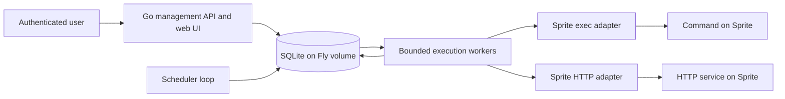

# Sprite Cron: design and research plan

Status: proposed design, before implementation. Research checked September 25, 2026.

## Recommendation

Build a Go service running continuously on one Fly Machine, with SQLite on a Fly
volume. Users configure jobs, schedules, Sprite targets, and named credentials
through an authenticated management API and a small web UI. A durable scheduler
creates run records; a bounded worker pool dispatches them through either the
Sprite exec API or an HTTP endpoint running inside a Sprite.

Start with a self-hosted application for one trusted team. Support several users
in that team, multiple Sprites, multiple organizations, and multiple credentials.
Defer public signup, billing, and isolation between unrelated customers. This
keeps the first version manageable without assuming there is only one Sprite or
one API key.

The central reliability rule is: **a lost connection does not prove a job failed
to run**. Record uncertain outcomes explicitly. Exactly-once external side
effects require cooperation from the job; a scheduler alone cannot guarantee them.

## What the research establishes

These are documented platform capabilities. Choices in later sections are our
proposals, and the research spikes below must verify uncertain behavior.

| Finding | Design implication | Source |
| --- | --- | --- |
| The API base is `https://api.sprites.dev/v1`, authenticated with a bearer token. | Keep authentication in the execution adapter. | [API overview](https://sprites.dev/api) |
| Get Sprite returns an ID, organization, HTTP URL, and URL authentication settings. Names are organization-relative. | Discover the URL; identify targets by organization and Sprite identity. | [Sprite API](https://sprites.dev/api/sprites) |
| Exec supports WebSocket and HTTP POST. WebSocket exposes session IDs, output, and exit status; sessions can be attached to and killed. Non-TTY disconnect survival defaults to 10 seconds and is configurable. | Prefer WebSocket for execution tracking and recovery; set disconnect behavior explicitly. | [Exec API](https://sprites.dev/api/sprites/exec) |
| Sprite HTTP URLs use bearer-token authentication by default; public access is optional. | Default to authenticated targets and allow separate HTTP credentials. | [CLI URL/auth reference](https://docs.sprites.dev/cli/commands/) |
| Incoming HTTP can wake a Sprite; a service configured with an HTTP port starts on request and receives traffic. | The target application must be installed as a Sprite service. | [Services](https://docs.sprites.dev/concepts/services/) |
| An official Go SDK provides an `exec.Cmd`-style interface. | Evaluate the SDK before implementing wire protocols. | [sprites-go](https://github.com/superfly/sprites-go) |
| Fly volumes are local to a host, attach to one Machine, and do not replicate automatically. | SQLite is appropriate for an initial singleton, with backups and accepted downtime. | [Fly volumes](https://docs.fly.io/volumes/overview/) |
| Fly Proxy autostart responds to traffic. | Keep the scheduler running; an internal deadline cannot wake a stopped Machine through incoming traffic. | [Autostop/autostart](https://fly.io/docs/launch/autostop-autostart/) |
| Fly app secrets are injected at runtime. | Store the credential encryption key separately from SQLite. | [Fly secrets](https://docs.fly.io/apps/secrets/) |

Do not assume API tokens are scoped to individual Sprites or that exec and HTTP
must use different tokens. The docs demonstrate organization tokens; verify
current token scope, expiry, and HTTP access policy during integration testing.
Multiple credential records must work regardless of token scope.

## User workflow and first-version scope

1. Sign in as a team member; an administrator adds a named Sprite credential.
2. Register a Sprite by name and credential. Fetch its organization, ID, and URL;
   show the resolved target before enabling jobs.
3. Create a job: choose exec or HTTP, enter a schedule and time zone, configure
   its payload and timeout, and preview its next five scheduled times.
4. Save disabled, run manually if desired, then enable the schedule.
5. Inspect run history, bounded output, errors, and the next scheduled execution.
   Pause, edit, manually retry, or request cancellation as needed.

Include job CRUD, pause/resume, run-now, schedule preview, credential rotation,
run history, audit events, and basic health/metrics. All job execution happens on
Sprites; the Fly Machine only coordinates work.

Defer DAGs, dependencies between jobs, arbitrary webhook destinations, automatic
Sprite provisioning, deployment of user code, interval/seconds schedules,
interactive terminals, and asynchronous HTTP completion protocols. The user is
responsible for installing the command or HTTP handler on the target Sprite.

## Architecture



Use one binary with packages for scheduling, storage, execution adapters,
credentials, and management. Prefer standard-library HTTP and templates for a
small UI. Evaluate `github.com/robfig/cron/v3` for parsing and computing the next
occurrence, not as the durable run store. Its documented five-field syntax and
time-zone support fit this proposal. Pin dependencies after the compatibility
spike. [Cron package documentation](https://pkg.go.dev/github.com/robfig/cron/v3)

Proposed starting capacity: 1,000 configured jobs and 10 concurrent attempts,
with configurable per-target limits. These are test targets, not performance
claims. Benchmark before promising capacity. Use one SQLite writer, short
transactions, foreign keys, WAL mode, a busy timeout, and durable commits. Never
hold a database transaction open while calling a Sprite.

## Target and credential model

Separate the Sprite, its authentication, and the job:

- **Credential:** ID, label, kind, encrypted value, key version, optional expiry,
  disabled state, creation/update timestamps, and validation result. Initial
  kinds: Sprite bearer token and application HTTP header secret.
- **Target:** local ID, Sprite name, resolved Sprite ID and organization, discovered
  HTTPS origin, management/exec credential reference, optional HTTP credential
  reference, auth mode, validation timestamp, and configuration revision.
- **Job:** target reference, optional authorized credential overrides, execution
  configuration, schedule, time zone, policy settings, and enabled state.

A credential can serve many targets; one target can reference different exec and
HTTP credentials. An HTTP job may additionally need an application secret, such
as `X-Job-Token`, distinct from Sprite edge authentication. Do not assume two
independent bearer tokens can occupy the same Authorization header. Confirm edge
header forwarding before selecting an application authentication contract.

The management/exec token is needed to validate and discover the target. For
HTTP, default to that token unless the user explicitly selects another. Make
public HTTP mode explicit, send no Sprite token in that mode, and still require
application authentication for a mutating job endpoint.

Treat the metadata URL as authoritative; never construct it from the Sprite
name. Verify supplied URL overrides against that origin in v1. Refresh metadata
on validation or configuration change, not on every tick. A changed Sprite ID
under the same name requires revalidation before dispatch: replacing a Sprite
must not silently redirect existing jobs.

Use a Fly secret for a versioned encryption key ring and authenticated encryption
(e.g. AES-GCM with fresh nonces and credential IDs as associated data) for stored
credentials. Never return plaintext credentials through list/read APIs. Keep
keys out of the database, logs, images, and repository. Back up the key ring
separately; an encrypted database backup alone cannot restore credentials.

Rotate by validating a replacement credential and atomically switching the
reference. New attempts use the current credential; record its version for
audit. Keep old credentials only as long as necessary for tracked sessions, then
revoke and remove them. Never try every saved key after an authorization failure.

## Job configuration examples

These examples illustrate the proposed management representation, not an
implemented configuration format. Credentials are references, never token values.

```yaml
name: nightly-report
schedule: "0 2 * * *"
timezone: UTC
target_id: reporting-sprite
execution:
  type: exec
  argv: ["/usr/bin/python3", "/home/sprite/jobs/report.py"]
  working_directory: /home/sprite/jobs
policy:
  timeout: 15m
  overlap: forbid
  misfire: skip
  start_grace: 60s
  max_attempts: 1
```

```yaml
name: refresh-index
schedule: "*/15 * * * *"
timezone: America/New_York
target_id: search-sprite
execution:
  type: http
  method: POST
  path: /jobs/refresh-index
  headers:
    Content-Type: application/json
  body: '{"collection":"products"}'
  success_statuses: [200, 204]
policy:
  timeout: 2m
  overlap: forbid
  misfire: coalesce
  start_grace: 60s
  max_attempts: 3
  retry_safe: true
```

The second example assumes the handler implements durable idempotency before
retries are enabled.

## Scheduling semantics

Use five fields: minute, hour, day of month, month, and day of week. Store an
explicit IANA time zone, default UTC; bundle time-zone data in the binary. Reject
seconds fields, inline time-zone prefixes, and schedules with no next occurrence.
Document standard cron's day-of-month/day-of-week OR behavior when both are
restricted. Return actionable validation errors and a next-occurrence preview.

Store all execution instants in UTC. Proposed DST policy: nonexistent local
times are skipped; repeated local times run at both distinct UTC instants. Verify
this behavior against the chosen parser and show both offsets in previews.

Each scheduled occurrence has a unique `(job_id, schedule_revision,
scheduled_at_utc)` key. A run ID identifies the logical invocation, while attempt
IDs identify dispatch attempts. Retries keep the same run ID and scheduled time.
Manual invocations have their own IDs and an API idempotency key to prevent
accidental duplicate submissions.

On a short periodic tick, the scheduler uses a transaction to materialize due
runs and advance the persisted `next_run_at`. A uniqueness constraint makes
repeated ticks harmless. A crash commits both changes or neither. Wake promptly
on configuration updates; periodically recheck wall time to handle clock changes.
Use monotonic clocks for in-process elapsed time and persist absolute deadlines
for restart recovery.

Define missed schedules and concurrency explicitly:

| Setting | Proposed behavior |
| --- | --- |
| `start_grace` | A due run may start up to 60 seconds late by default. Recheck before dispatch. |
| `misfire: skip` (default) | Record older occurrences as skipped; resume with eligible/future occurrences. |
| `misfire: coalesce` | When several occurrences are missed, create at most one catch-up run for the latest missed occurrence, then resume normally. |
| Long downtime | Process bounded batches and summarize skipped ranges/counts; never allocate an unbounded backlog. |
| `overlap: forbid` (default) | If a prior run is active, awaiting retry, or unresolved, record the new occurrence as skipped for overlap. |
| `overlap: allow` | Allow concurrent runs up to configured job, target, and global limits. |
| Capacity exhausted | Keep due work queued only within its grace/catch-up deadline; expire it with an explicit reason afterward. |
| Pause | Stop new scheduled work and cancel queued scheduled runs; active work continues unless separately cancelled. |
| Edit | Create a new revision, cancel old queued scheduled runs, and calculate the next time from the edit. Active runs keep their snapshots. |
| Resume | Schedule from the resume time; do not backfill the paused interval. |

For coalescing, set a fresh bounded dispatch deadline when materializing the
catch-up run. Do not repeatedly coalesce the same window: advance the schedule
cursor in the same transaction. Run-now obeys concurrency limits and is available
while a schedule is paused. Pausing does not erase run history.

## Durable execution and failure handling

Persist an immutable execution snapshot when creating a run: command or request,
target identity, nonsecret settings, credential references, policy, and schedule
revision. Workers claim pending attempts transactionally and mark them
`dispatching` **before** network I/O. Persist the session ID as soon as available.
Only a confirmed command exit or an agreed HTTP completion response is success.

Proposed run states: `queued`, `dispatching`, `running`, `retry_wait`, `succeeded`,
`failed`, `skipped`, `cancelled`, `timed_out`, and `unknown`. Keep the execution
outcome separate from cancellation requests and observed remote liveness. A
local timeout is not confirmation that the remote process stopped.

| Failure point | Recovery |
| --- | --- |
| Before a run transaction commits | Recompute from the persisted schedule cursor. |
| Queued, before the worker claims it | Another tick/worker can claim the existing record. |
| Claimed, before or during dispatch | If dispatch cannot be ruled out, treat as uncertain, even if the process might have crashed before sending. |
| Exec session ID recorded, stream lost | Try to reconnect to that exact session; never start a new command merely to reconnect. |
| Remote started, session ID or final result not saved | Mark `unknown`; absence from the session list is not proof of failure. |
| HTTP request sent, response lost | Mark `unknown`; retry only under an explicit idempotency contract. |
| Final result received, database write fails | Stop new dispatch if storage is unhealthy; retain/report uncertainty on recovery. |

Default to one attempt. Offer capped exponential backoff with jitter, persisted
retry timestamps, a total retry deadline, and a maximum attempt count. Retry
known pre-dispatch transient failures. Retry post-dispatch failures, 429/5xx,
nonzero exits, or uncertain outcomes only for jobs explicitly declared safe to
repeat; honor a bounded `Retry-After`. Authentication/configuration failures need
intervention. Audit manual retries and warn when the prior outcome is unknown.

Send a stable logical run ID as `Idempotency-Key` and `X-Sprite-Cron-Run-ID` for
HTTP; provide equivalent run metadata to exec jobs. A repeated header is not
itself deduplication: the Sprite application must durably store the key and
coordinate it with its side effects. For operations against another service,
propagate an idempotency key supported by that service where possible.

Keep unresolved runs blocking `overlap: forbid` until reconciliation confirms
completion/termination, or an operator explicitly accepts the duplicate/overlap
risk. Lease expiration permits investigation, not automatic redispatch. A
singleton process lock guards against a second scheduler on the same database;
independent copied databases are never supported as active schedulers.

## Exec adapter

Prefer the official Go SDK if its pinned version exposes the required session
and cancellation controls. Keep it behind an interface so a small direct
WebSocket adapter remains possible. Use non-TTY execution, explicit argv, bounded
stdout/stderr capture, and an observed exit code. Shell syntax requires an
explicit shell invocation; never interpolate user values into a shell command.

Set an explicit disconnect survival window (proposed 60 seconds) and try
reattachment within it. Persist the overall deadline. A timeout/cancellation
requests remote termination using the recorded session ID, follows progress,
and escalates when supported. If termination cannot be established, retain
unknown remote liveness and the overlap block. Do not equate a closed socket,
context cancellation, or HTTP 200 from a kill request with confirmed termination.

Verify working-directory and environment behavior in the SDK. The WebSocket
reference says supplied environment entries replace defaults; do not accidentally
remove PATH/HOME when adding run metadata. Verify output replay and completed
session retention; flag possible replayed or missing output after reconnect.
The HTTP POST exec alternative is distinct from calling the user's HTTP server;
its result/framing contract needs a separate spike before using it as a fallback.

## HTTP adapter and handler contract

Use Go's HTTP client with TLS verification, connection/response deadlines, a
bounded body, and redirects disabled. Combine only a validated relative path
with the target's approved HTTPS origin. Reject userinfo, host overrides,
absolute/network-path URLs, and reserved authentication/forwarding headers.

V1 handlers finish work before returning one of the configured success statuses.
Default success is 2xx except 202. Treat 202 as `unknown` with an unsupported
asynchronous-response reason, since it may mean work was accepted. Later we can
add an explicit operation ID and authenticated status/cancellation protocol;
acceptance alone must never be labeled completed work.

A request timeout or disconnect cannot cancel application work reliably. The
handler must enforce its own deadline and implement idempotency when enabled.
Use a dedicated job endpoint, not a generic command-execution or file-serving
endpoint. Require method/body semantics to be deliberately defined by its owner.

## Storage and management

Proposed tables:

| Table | Purpose |
| --- | --- |
| `users`, `sessions` | Team identities, roles, and expiring login sessions. |
| `credentials`, `credential_versions` | Encrypted values, labels, and rotation history. |
| `targets` | Verified Sprite identity, origin, and allowed credential bindings. |
| `jobs`, `job_revisions` | Current schedule cursor and immutable configuration revisions. |
| `runs` | Logical occurrences, execution snapshots, status, and overlap ownership. |
| `attempts` | Dispatch state, session ID, deadlines, response/exit details, and bounded output. |
| `audit_events` | Actor, action, object, timestamp, and redacted changes. |

Index enabled jobs by next occurrence, attempts by status/retry time, and run
history by job/time. Uniqueness constraints enforce occurrence and manual-request
idempotency. Keep migrations versioned and take a consistent backup before
schema changes. Redacted configuration exports should be portable but are not a
replacement for run-state backups.

Suggested API resources: `/api/targets`, `/api/credentials`, `/api/jobs`,
`/api/jobs/{id}/runs`, `/api/runs/{id}`, `/api/runs/{id}/cancel`, and
`/api/schedules/preview`. Use optimistic concurrency for edits and pagination for
history. Run-now is a POST; all state-changing operations require authorization.
The UI should show schedule/time zone, next occurrence, last outcome, lateness,
and unresolved runs without exposing secret values.

## Security boundary

Job authors can execute code with the authority of the credentials assigned to
their targets. In v1, everyone with an operator role is trusted within the team;
readers cannot edit or run jobs, and administrators control credentials and target
bindings. Independent customer isolation would require a separate design.

Use established OIDC login rather than custom password handling, server-side
sessions, secure HttpOnly cookies, CSRF protection, and audited role checks.
Require TLS on management access. Keep diagnostic/metrics endpoints private and
public health responses minimal. Do not expose environment dumps or arbitrary
filesystem reads.

Prevent SSRF and credential leakage: pin exec to the official API origin; pin
HTTP to the verified Sprite origin; block private, loopback, link-local, and
metadata destinations at dial time, including DNS rebinding. Never forward
credentials on redirects. Do not permit arbitrary custom origins in v1.

Treat response bodies, command output, argv, and errors as potentially sensitive.
Redact known credentials, avoid logging full request URLs or headers, escape UI
output, and disable raw debug dumps. Redaction cannot detect every secret a job
prints; restrict access to logs and allow capture to be disabled. Secret command
inputs should use a dedicated secret mechanism, not literal argv or logged query
parameters. Sprite API credentials must never be injected into the executed job.

## Fly.io deployment and operations

Start with one Machine in one region and a volume mounted at `/data`, storing
`/data/sprite-cron.db`. Disable automatic stopping (`auto_stop_machines = "off"`
for a configured HTTP service), explicitly deploy one Machine, and configure
restart behavior. Do not allow deployment tooling to create a second independent
scheduler. Use a shutdown procedure that stops claims, drains bounded work, and
leaves unfinished attempts available for reconciliation.
[Fly configuration reference](https://fly.io/docs/reference/configuration/)

A singleton accepts maintenance and host-failure downtime. Fly recommends
redundancy for availability, and daily volume snapshots are not a primary backup
strategy. Take application-consistent encrypted backups to independent object
storage, monitor backup age, and test restoring the database plus encryption
keys. Run SQLite migrations on the volume-owning Machine before scheduling;
Fly release-command Machines do not mount the volume.
[Fly storage constraints](https://docs.fly.io/volumes/overview/)

Proposed initial operating settings, adjustable after load tests:

- 1 shared CPU, 512 MiB RAM, and a 3 GiB volume.
- 10 concurrent attempts globally, 2 per target, and a bounded pending queue.
- 1 MiB retained output per attempt, 64 KiB HTTP request bodies, and 30-day history.
- A global output storage budget (initially 512 MiB), pruning closed runs before
  that budget is exhausted; never let per-run limits alone fill the volume.
- Hourly consistent backups, with an initial recovery-point target of one hour
  and recovery-time target of one hour, both requiring a measured restore drill.

Expose metrics for dispatch lag, queue depth, active/unknown runs, failures,
credential errors, reconnects, disk usage, and backup age. Health must include a
scheduler heartbeat and database health, not just an HTTP listener. Alert on
missed heartbeats, uncertain outcomes, repeated failures, and low storage.

Restore with dispatch disabled. Reconcile restored in-flight records against
remote activity; a stale backup may predate completed work and cannot prove it
safe to replay. Advance scheduling from an explicitly selected recovery cutoff
and require deliberate catch-up decisions. Never run the old and restored
scheduler concurrently.

For higher availability, move durable state to shared PostgreSQL and add atomic
claims, leader election/fencing, and worker leases before adding Machines. A
second SQLite volume alone gives neither shared state nor duplicate prevention.
Keep exactly-once limitations even after this migration. If strict availability
is needed at launch, select PostgreSQL from the start.

## Implementation sequence and acceptance criteria

### 1. Compatibility and failure research

Use a disposable test Sprite in the later implementation phase. Pin the SDK and
record observed behavior and versions:

- Validate token scope, multiple tokens, rotation/revocation, and the same token
  against exec and authenticated HTTP, including URL access settings.
- Verify name/organization/ID discovery and replacement detection.
- Exercise non-TTY exec, environment, directory, output, nonzero exits, session
  IDs, reconnect, output replay, disconnect lifetime, and process-group killing.
- Interrupt exec before/after session-ID receipt and before result persistence;
  establish what completed-session information survives and for how long.
- Exercise cold HTTP startup, app authentication headers, response loss, timeout,
  redirect rejection, 202, and a handler implementing durable idempotency.

Deliver a compatibility note and the selected adapter approach. These are not
live-tested claims in this document. Do not build reliability promises on
unverified SDK behavior or undocumented API limits.

### 2. Durable scheduling core

Implement migrations, job revisions, parser/preview, run materialization,
claiming, and policies with a fake clock and fake executor. Acceptance: repeated
ticks and crash injection do not duplicate occurrence records; UTC/DST, clock
changes, leap days, missed schedules, overlap, pause/edit/resume, bounded catch-up,
and concurrent run-now requests have explicit tested outcomes.

### 3. Execution adapters and recovery

Implement exec and HTTP, bounded output, credentials, retries, cancellation, and
restart reconciliation. Acceptance: integration tests cover both transports,
nonzero exits, slow starts, network interruption, token failure, and disk-write
failure. Kill/restart the scheduler around every dispatch/result boundary and
verify uncertain work is not blindly repeated.

### 4. Management API and UI

Implement login/roles, job and target forms, schedule previews, credential
rotation, audit, and run history. Acceptance: unauthorized access fails, CSRF and
SSRF tests pass, secret values never appear in API reads/logs, and output is
safely rendered. A user can configure and diagnose both kinds of job end to end.

### 5. Fly deployment and operational validation

Add the container, Fly configuration, shutdown/restart handling, backups,
metrics, and an operations guide. Acceptance: schedules survive deployment;
downtime follows misfire policy; a restore drill meets the chosen targets;
capacity/output tests stay within the configured resource budget. Confirm there
is exactly one active scheduler before enabling production jobs.

## Decisions to revisit together

The proposal supplies defaults so planning can proceed; these are the most
useful decisions to settle before implementation:

1. Is this for one trusted team, or must unrelated customers have isolated
   accounts? Default: one team with administrator/operator/reader roles.
2. Is occasional deployment/host downtime acceptable? Default: singleton SQLite;
   use PostgreSQL and redundant Machines if availability is a launch requirement.
3. Should missed work be skipped or caught up? Default: skip, with per-job
   coalescing; no unbounded replay.
4. Are HTTP jobs synchronous? Default: yes. Async work needs a defined status and
   cancellation contract before it can be tracked accurately.
5. Which identity provider and initial workloads should drive the integration
   tests? Obtain workload duration, output size, and duplicate-execution tolerance
   before finalizing deployment sizing and retry defaults.
